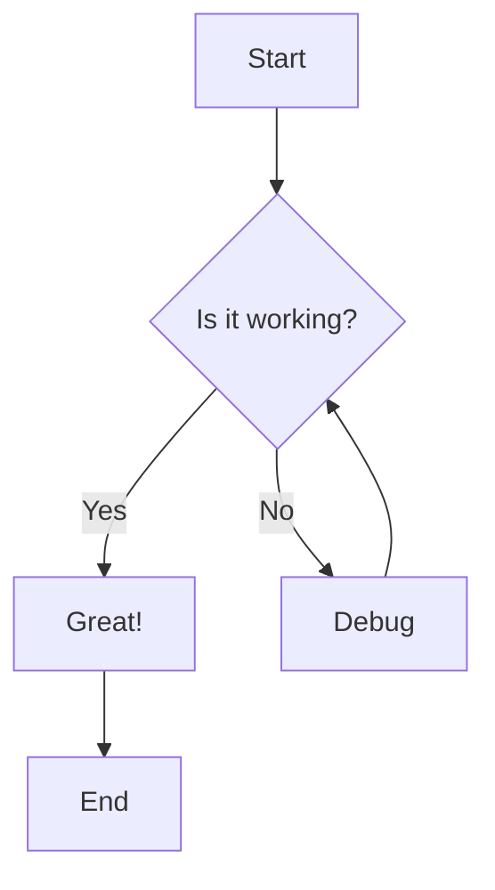
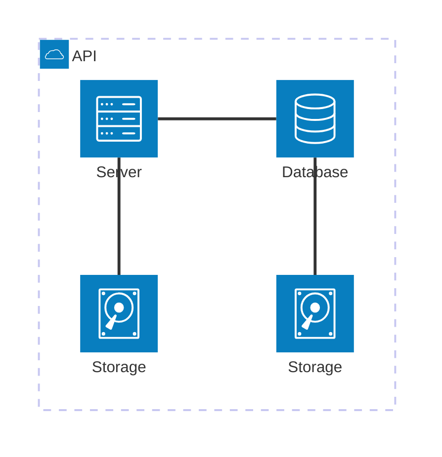
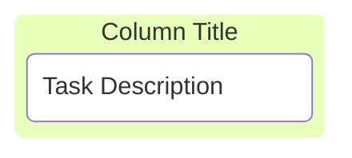
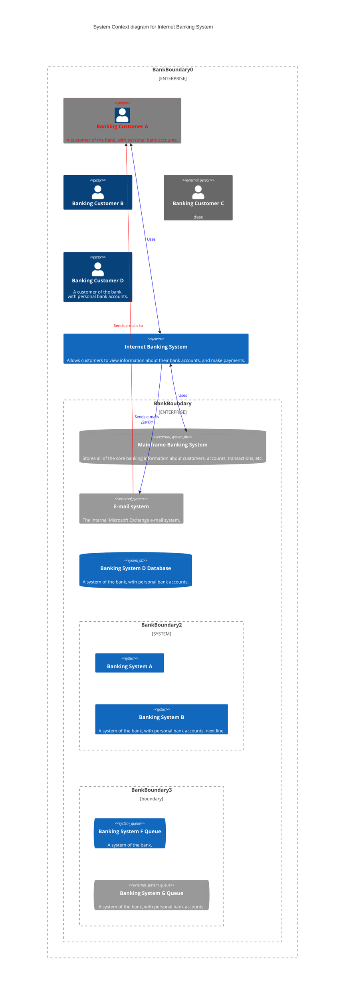

# Test Markdown

This is a **test** document with _markdown_ content.

## Test Image

%3C%2Ftext%3E%3C%2Fsvg%3E)

## Mermaid Diagram

Here's a mermaid flowchart:











## Code Block

```javascript
function hello() {
  console.log("Hello from mdmaid!");
}
```

## List
test!
- Item 1
- Item 2
- Item 3
