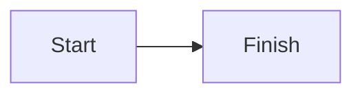
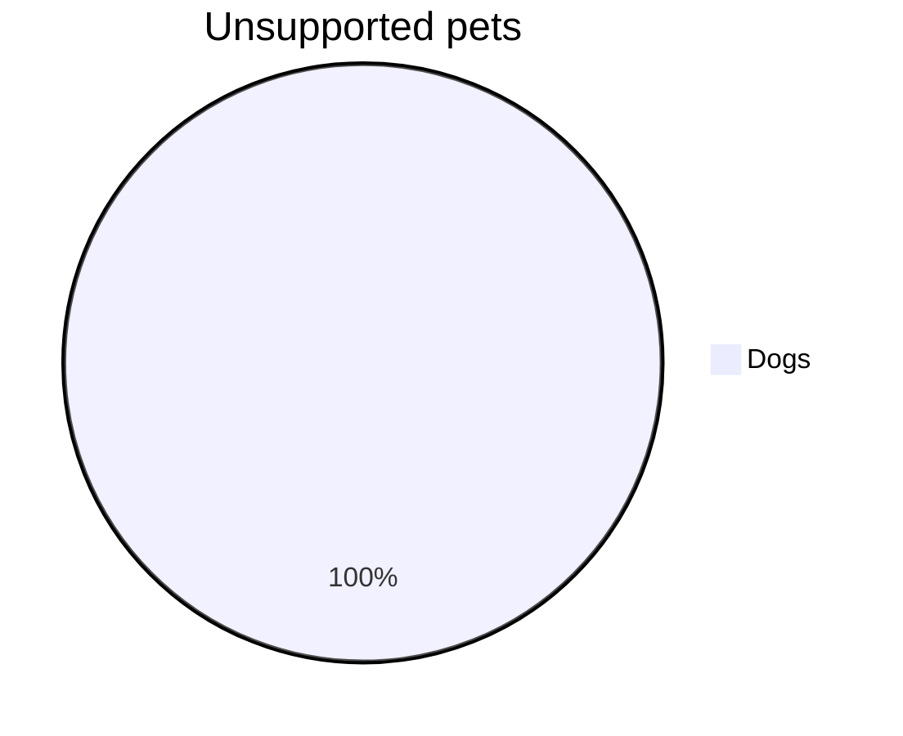

# Heading one

## Heading two

### Heading three

#### Heading four

##### Heading five

###### Heading six

This paragraph contains **bold text**, *italic text*, ~~removed text~~,
`inlineCode()`, and [mdmaid documentation](https://example.com/mdmaid).

This deliberately long paragraph must wrap cleanly at narrow terminal widths
without splitting wide glyphs such as 文, emoji such as 🧭, or words into
unreadable fragments when a normal word boundary is available.

- Unordered item
  - Nested unordered item
- [x] Completed task
- [ ] Pending task

1. First ordered item
2. Second ordered item
   1. Nested ordered item

> A quoted paragraph with **emphasis** that also needs to wrap safely when the
> available terminal width is narrow.

---

| Element | Presentation | Notes |
| :--- | :---: | ---: |
| Heading | Hierarchy | Clear |
| Table | Width aware | 文 and 🧭 |

```typescript
const value: number = 42;
function double(input: number): number {
  return input * 2;
}
```

```mysterylang
mystery_call("plain fallback");
```





Terminal attack: {{ESC}}[2Jvisible text {{ESC}}]52;c;SECRET{{BEL}}
after clipboard{{NUL}}end.
